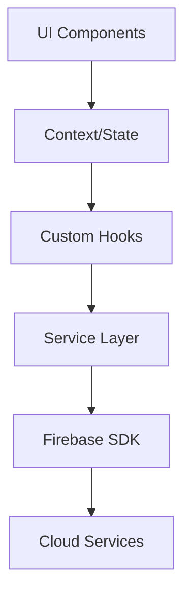

# 🚀 Cours Technique Luna - Architecture & Développement

## Table des Matières

1. [Vue d'Ensemble](#vue-densemble)
2. [Architecture](#architecture)
3. [Technologies](#technologies)
4. [Structure du Code](#structure-du-code)
5. [Patterns & Best Practices](#patterns--best-practices)
6. [Développement Pas à Pas](#développement-pas-à-pas)
7. [Optimisations](#optimisations)

---

## Vue d'Ensemble

### Architecture Technique

```
┌─────────────────────────────────────────────────────────┐
│                    Frontend (React Native)               │
├─────────────────────────────────────────────────────────┤
│                    Expo SDK 52                          │
├─────────────────────────────────────────────────────────┤
│                 State Management (Context)               │
├─────────────────────────────────────────────────────────┤
│                  Services Layer                          │
├─────────────────────────────────────────────────────────┤
│                    Firebase SDK                          │
├─────────────────────────────────────────────────────────┤
│         Backend (Firebase + Cloud Functions)             │
└─────────────────────────────────────────────────────────┘
```

### Stack Technologique

**Frontend:**
- React Native 0.76
- Expo SDK 52
- TypeScript 5.3
- Expo Router (navigation)
- React Native Web

**Backend:**
- Firebase Auth
- Cloud Firestore
- Cloud Storage
- Cloud Functions
- Vertex AI (Gemini)

**Outils:**
- ESLint + Prettier
- Jest (tests)
- GitHub Actions (CI/CD)

---

## Architecture

### 1. Architecture en Couches

```typescript
// Présentation Layer
app/
  ├── (tabs)/        # Navigation principale
  ├── (auth)/        # Authentification
  ├── (onboarding)/  # Onboarding flow
  └── screens/       # Écrans individuels

// Business Logic Layer  
src/
  ├── contexts/      # State management
  ├── hooks/         # Custom hooks
  ├── services/      # Business logic
  └── utils/         # Helpers

// Data Layer
firebase/
  ├── firestore/     # Database
  ├── functions/     # Serverless
  └── storage/       # Files
```

### 2. Flux de Données



### 3. Patterns Architecturaux

#### Repository Pattern
```typescript
// Service comme repository
export class JournalService {
  // Abstraction de la source de données
  async getEntries(userId: string): Promise<JournalEntry[]> {
    return firestore
      .collection('entries')
      .where('userId', '==', userId)
      .get();
  }
}
```

#### Provider Pattern
```typescript
// Context pour state management
export const AuthProvider: React.FC = ({ children }) => {
  const [user, setUser] = useState<User | null>(null);
  
  return (
    <AuthContext.Provider value={{ user, setUser }}>
      {children}
    </AuthContext.Provider>
  );
};
```

---

## Technologies

### React Native & Expo

#### Pourquoi Expo?
- **Développement rapide**: Hot reload, outils intégrés
- **Cross-platform**: iOS, Android, Web
- **APIs natives**: Camera, notifications, etc.
- **OTA updates**: Mises à jour sans app store

#### Configuration Expo
```json
{
  "expo": {
    "name": "Luna",
    "slug": "luna-app",
    "version": "1.0.0",
    "platforms": ["ios", "android", "web"],
    "plugins": [
      "expo-router",
      "@react-native-firebase/app"
    ]
  }
}
```

### TypeScript

#### Types Stricts
```typescript
// Types pour sécurité
interface JournalEntry {
  id: string;
  userId: string;
  content: string;
  mood?: Mood;
  tags: string[];
  createdAt: Date;
  updatedAt: Date;
}

// Enums pour constantes
enum MoodValue {
  DEPRESSED = 1,
  UPSET = 2,
  ANXIOUS = 3,
  SAD = 4,
  NEUTRAL = 5,
  OKAY = 6,
  CALM = 7,
  HAPPY = 8,
  JOYFUL = 9
}
```

### Firebase Integration

#### Firestore Structure
```
users/
  └── {userId}/
      ├── profile
      ├── settings
      └── stats

entries/
  └── {entryId}/
      ├── userId
      ├── content
      ├── mood
      └── timestamps

relationships/
  └── {relationshipId}/
      ├── userId
      ├── name
      └── type
```

#### Security Rules
```javascript
// Firestore rules
rules_version = '2';
service cloud.firestore {
  match /databases/{database}/documents {
    // Users can only access their data
    match /entries/{entry} {
      allow read, write: if request.auth != null 
        && request.auth.uid == resource.data.userId;
    }
  }
}
```

---

## Structure du Code

### 1. Organisation des Dossiers

```
luna-app/
├── app/                    # Écrans et navigation
│   ├── (tabs)/            # Tab navigation
│   │   ├── _layout.tsx    # Tab config
│   │   ├── index.tsx      # Home
│   │   ├── journal.tsx    # Journal
│   │   ├── chat.tsx       # AI Chat
│   │   ├── insights.tsx   # Analytics
│   │   └── profile.tsx    # Profile
│   ├── (auth)/            # Auth flow
│   └── (onboarding)/      # Onboarding
├── src/
│   ├── components/        # UI composants
│   ├── contexts/          # Global state
│   ├── hooks/             # Custom hooks
│   ├── services/          # Business logic
│   ├── styles/            # Thème global
│   ├── types/             # TypeScript types
│   └── utils/             # Helpers
└── assets/                # Images, fonts
```

### 2. Composants Réutilisables

#### Button Component
```typescript
// src/components/Button.tsx
interface ButtonProps {
  title: string;
  onPress: () => void;
  variant?: 'primary' | 'secondary' | 'ghost';
  loading?: boolean;
  disabled?: boolean;
}

export const Button: React.FC<ButtonProps> = ({
  title,
  onPress,
  variant = 'primary',
  loading = false,
  disabled = false,
}) => {
  const styles = getStyles(variant);
  
  return (
    <TouchableOpacity
      style={[styles.button, disabled && styles.disabled]}
      onPress={onPress}
      disabled={disabled || loading}
    >
      {loading ? (
        <ActivityIndicator color="#fff" />
      ) : (
        <Text style={styles.text}>{title}</Text>
      )}
    </TouchableOpacity>
  );
};
```

### 3. Services Architecture

#### Base Service
```typescript
// src/services/base.service.ts
export abstract class BaseService {
  protected collection: string;
  
  constructor(collection: string) {
    this.collection = collection;
  }
  
  protected get db() {
    return firestore().collection(this.collection);
  }
  
  async create<T>(data: T): Promise<string> {
    const doc = await this.db.add(data);
    return doc.id;
  }
}
```

#### Journal Service
```typescript
// src/services/journal.service.ts
export class JournalService extends BaseService {
  constructor() {
    super('entries');
  }
  
  async getUserEntries(
    userId: string, 
    limit = 10
  ): Promise<JournalEntry[]> {
    const snapshot = await this.db
      .where('userId', '==', userId)
      .orderBy('createdAt', 'desc')
      .limit(limit)
      .get();
      
    return snapshot.docs.map(doc => ({
      id: doc.id,
      ...doc.data()
    })) as JournalEntry[];
  }
}
```

---

## Patterns & Best Practices

### 1. State Management

#### Context Pattern
```typescript
// Global state avec Context
const AppStateContext = createContext<AppState | null>(null);

export const useAppState = () => {
  const context = useContext(AppStateContext);
  if (!context) {
    throw new Error('useAppState must be used within AppStateProvider');
  }
  return context;
};
```

#### Custom Hooks
```typescript
// Hook pour data fetching
export const useJournalEntries = (userId: string) => {
  const [entries, setEntries] = useState<JournalEntry[]>([]);
  const [loading, setLoading] = useState(true);
  const [error, setError] = useState<Error | null>(null);
  
  useEffect(() => {
    const fetchEntries = async () => {
      try {
        setLoading(true);
        const data = await journalService.getUserEntries(userId);
        setEntries(data);
      } catch (err) {
        setError(err as Error);
      } finally {
        setLoading(false);
      }
    };
    
    fetchEntries();
  }, [userId]);
  
  return { entries, loading, error, refetch: fetchEntries };
};
```

### 2. Performance Optimization

#### Memoization
```typescript
// Éviter re-renders inutiles
const MoodSelector = React.memo(({ 
  selectedMood, 
  onSelect 
}: MoodSelectorProps) => {
  return (
    <View style={styles.container}>
      {MOOD_OPTIONS.map(mood => (
        <MoodOption
          key={mood.value}
          mood={mood}
          selected={selectedMood?.value === mood.value}
          onPress={() => onSelect(mood)}
        />
      ))}
    </View>
  );
});
```

#### Lazy Loading
```typescript
// Chargement différé des écrans
const ProfileSettings = lazy(() => import('./ProfileSettings'));

// Dans le composant
<Suspense fallback={<LoadingScreen />}>
  <ProfileSettings />
</Suspense>
```

### 3. Error Handling

#### Global Error Boundary
```typescript
class ErrorBoundary extends Component<Props, State> {
  state = { hasError: false, error: null };
  
  static getDerivedStateFromError(error: Error) {
    return { hasError: true, error };
  }
  
  componentDidCatch(error: Error, errorInfo: ErrorInfo) {
    console.error('Error caught by boundary:', error, errorInfo);
    // Envoyer à service de monitoring
  }
  
  render() {
    if (this.state.hasError) {
      return <ErrorScreen error={this.state.error} />;
    }
    
    return this.props.children;
  }
}
```

---

## Développement Pas à Pas

### Tutoriel: Créer une Nouvelle Feature

#### Étape 1: Définir les Types
```typescript
// src/types/meditation.ts
export interface Meditation {
  id: string;
  title: string;
  duration: number; // secondes
  category: 'sleep' | 'anxiety' | 'focus';
  audioUrl: string;
}
```

#### Étape 2: Créer le Service
```typescript
// src/services/meditation.service.ts
export class MeditationService extends BaseService {
  constructor() {
    super('meditations');
  }
  
  async getMeditations(category?: string): Promise<Meditation[]> {
    let query = this.db.orderBy('duration', 'asc');
    
    if (category) {
      query = query.where('category', '==', category);
    }
    
    const snapshot = await query.get();
    return snapshot.docs.map(doc => ({
      id: doc.id,
      ...doc.data()
    })) as Meditation[];
  }
}

export const meditationService = new MeditationService();
```

#### Étape 3: Créer le Hook
```typescript
// src/hooks/useMeditations.ts
export const useMeditations = (category?: string) => {
  const [meditations, setMeditations] = useState<Meditation[]>([]);
  const [loading, setLoading] = useState(true);
  
  useEffect(() => {
    const load = async () => {
      try {
        const data = await meditationService.getMeditations(category);
        setMeditations(data);
      } finally {
        setLoading(false);
      }
    };
    
    load();
  }, [category]);
  
  return { meditations, loading };
};
```

#### Étape 4: Créer l'UI
```typescript
// app/meditations.tsx
export default function MeditationsScreen() {
  const [category, setCategory] = useState<string | undefined>();
  const { meditations, loading } = useMeditations(category);
  
  if (loading) {
    return <LoadingScreen />;
  }
  
  return (
    <SafeAreaView style={styles.container}>
      <CategoryFilter 
        selected={category}
        onSelect={setCategory}
      />
      <FlatList
        data={meditations}
        keyExtractor={(item) => item.id}
        renderItem={({ item }) => (
          <MeditationCard
            meditation={item}
            onPress={() => playMeditation(item)}
          />
        )}
      />
    </SafeAreaView>
  );
}
```

---

## Optimisations

### 1. Performance Mobile

#### Image Optimization
```typescript
// Utiliser expo-image pour performance
import { Image } from 'expo-image';

<Image
  source={{ uri: photoUrl }}
  style={styles.image}
  contentFit="cover"
  transition={200}
  placeholder={blurhash}
/>
```

#### List Optimization
```typescript
// FlatList optimisée
<FlatList
  data={entries}
  renderItem={renderItem}
  keyExtractor={(item) => item.id}
  
  // Optimisations
  removeClippedSubviews={true}
  maxToRenderPerBatch={10}
  updateCellsBatchingPeriod={50}
  windowSize={10}
  
  // Éviter re-renders
  getItemLayout={(data, index) => ({
    length: ITEM_HEIGHT,
    offset: ITEM_HEIGHT * index,
    index,
  })}
/>
```

### 2. Bundle Size

#### Code Splitting
```typescript
// Routes dynamiques pour code splitting
export async function generateStaticParams() {
  return [
    { screen: 'profile' },
    { screen: 'settings' },
  ];
}
```

#### Tree Shaking
```typescript
// Import sélectif
import { collection, query, where } from 'firebase/firestore';
// Au lieu de
import * as firestore from 'firebase/firestore';
```

### 3. Offline Support

#### Cache Strategy
```typescript
// AsyncStorage pour cache
const CACHE_KEY = 'journal_entries';
const CACHE_DURATION = 1000 * 60 * 5; // 5 minutes

export const getCachedEntries = async (): Promise<JournalEntry[] | null> => {
  try {
    const cached = await AsyncStorage.getItem(CACHE_KEY);
    if (!cached) return null;
    
    const { data, timestamp } = JSON.parse(cached);
    
    if (Date.now() - timestamp > CACHE_DURATION) {
      await AsyncStorage.removeItem(CACHE_KEY);
      return null;
    }
    
    return data;
  } catch {
    return null;
  }
};
```

---

## Ressources & Suite

### Documentation
- [React Native](https://reactnative.dev/docs/getting-started)
- [Expo](https://docs.expo.dev)
- [Firebase](https://firebase.google.com/docs)
- [TypeScript](https://www.typescriptlang.org/docs)

### Prochaines Étapes
1. Tests unitaires avec Jest
2. E2E tests avec Detox
3. CI/CD avec GitHub Actions
4. Monitoring avec Sentry
5. Analytics avec Mixpanel

### Contact
- GitHub: [luna-app](https://github.com/luna-app)
- Email: dev@luna-app.com

---

*Version: 1.0.0 | Dernière mise à jour: Janvier 2025*